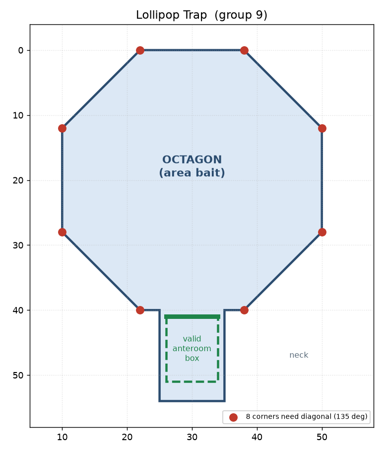

# lollipop trap (group 9)

big octagon room (the candy) with a little square anteroom hanging off a thin
neck (the stick) — so the room looks like a lollipop. weights are area-greedy so
the obvious move is to wrap the big round part. but the catch isn't the shape or
the weights, it's the connector bin: the octagon's 8 corners each need a diagonal
(135°) connector and there are only 2 in stock. walls are plentiful, so diagonals
are provably the thing you run out of. go for the big room and you get "not enough
diagonal connectors" — submit it anyway and it's −1000. the actual play is to
ignore the bait and box the little anteroom with four right-angle connectors
(gate 8 + walls 10,8,10). checked it against the sim: the box scores 1284, and the
bundled example player (`--player e`) does exactly that and lands 1344.

reproduce:
`uv run main.py --player e --scenario scenarios/players/player9/lollipop_trap.json`
(add `--sandbox` to just look at the room in the gui).

the png is just matplotlib for the writeup — not a sim dependency.
